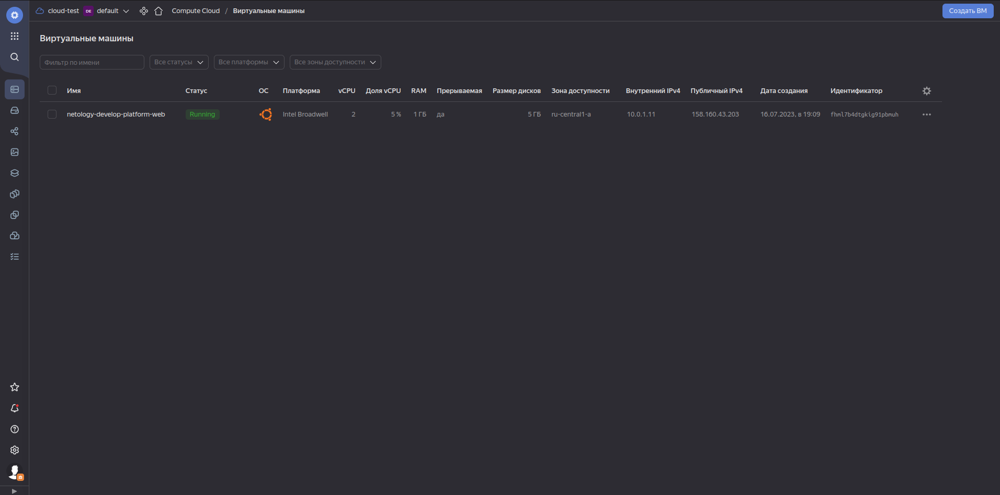
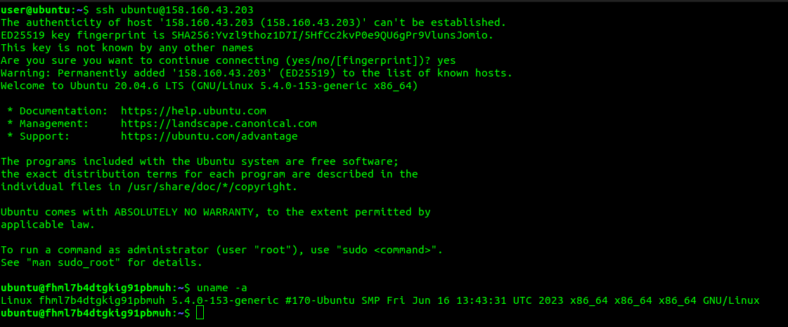
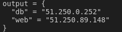

## Решение Домашнего задания 2

### Задание 1
4. Суть допущенных ошибок заключается в том, чтобы мы поняли, что при неправильном указании параметров для инициализации ресурса этот ресурс не сможет быть создан, а при их исправлении и перезапуске команды terraform apply те ресурсы, которые уже были созданы, не будут пересоздаваться.  

5. Параметр ```preemptible = true``` отвечает за то, что создаваемая ВМ будет прерываемой, то есть её можно будет остановить или удалить в любой момент

    Параметр ```core_fraction=5``` отвечает за уровень производительности vCPU. Виртуальные машины с уровнем производительности меньше 100% имеют доступ к вычислительной мощности физических ядер как минимум на протяжении указанного процента от единицы времени.

-------

### Вложения:

<details>
<summary> Скриншоты </summary>



</details>


### Задание 4

Вывод команды ```terraform output```: 

